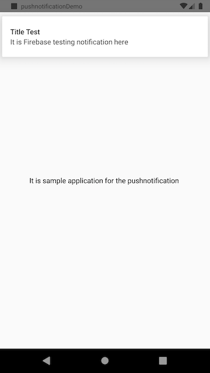
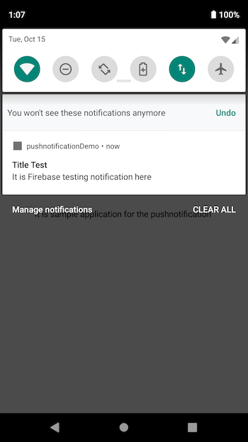

# ReactNativePushnotification
It is a small demo application for React Native Android application

## Create your firebase application using firebase guide line 

```
https://firebase.google.com/?gclid=EAIaIQobChMI3oTK9uOd5QIVixePCh12oQ38EAAYASAAEgI7ifD_BwE
```
Get the google json file from firebase console and put it inside android/app/google-services.json
and then 

Add npm packages 

```
npm install
````

# Run Application on Android

```
react-native run-android
```




